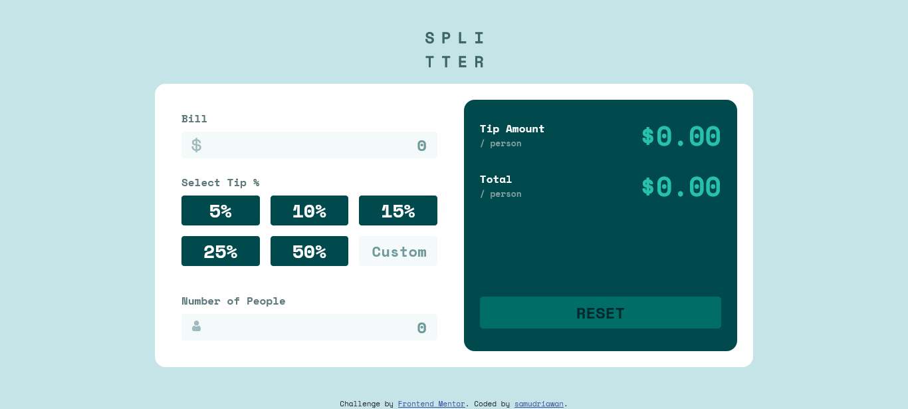

# Frontend Mentor - Tip calculator app solution

This is a solution to the [Tip calculator app challenge on Frontend Mentor](https://www.frontendmentor.io/challenges/tip-calculator-app-ugJNGbJUX). Frontend Mentor challenges help you improve your coding skills by building realistic projects.

## Table of contents

- [Overview](#overview)
  - [The challenge](#the-challenge)
  - [Screenshot](#screenshot)
  - [Links](#links)
- [My process](#my-process)
  - [Built with](#built-with)
  - [What I learned](#what-i-learned)
  - [Continued development](#continued-development)
  - [Useful resources](#useful-resources)
- [Author](#author)
- [Acknowledgments](#acknowledgments)

## Overview

### Screenshot

### The challenge

Users should be able to:

- View the optimal layout for the app depending on their device's screen size
- See hover states for all interactive elements on the page
- Calculate the correct tip and total cost of the bill per person

### Links

[Solution URL]() |
[Live Site URL]() |
[Challenge](https://www.frontendmentor.io/challenges/tip-calculator-app-ugJNGbJUX)

## My process

### Built with

- Semantic HTML5 markup
- Flexbox
- Mobile-first workflow
- Bootstrap
- [SASS](https://sass-lang.com/)

### What I learned

client form validation and calculation.

## Contact

- Github - [@samudriawan](https://github.com/samudriawan/)
- Twitter - [@samudriawan](https://twitter.com/samudriawan)
- Frontend Mentor - [@samudriawan](https://www.frontendmentor.io/profile/samudriawan)
